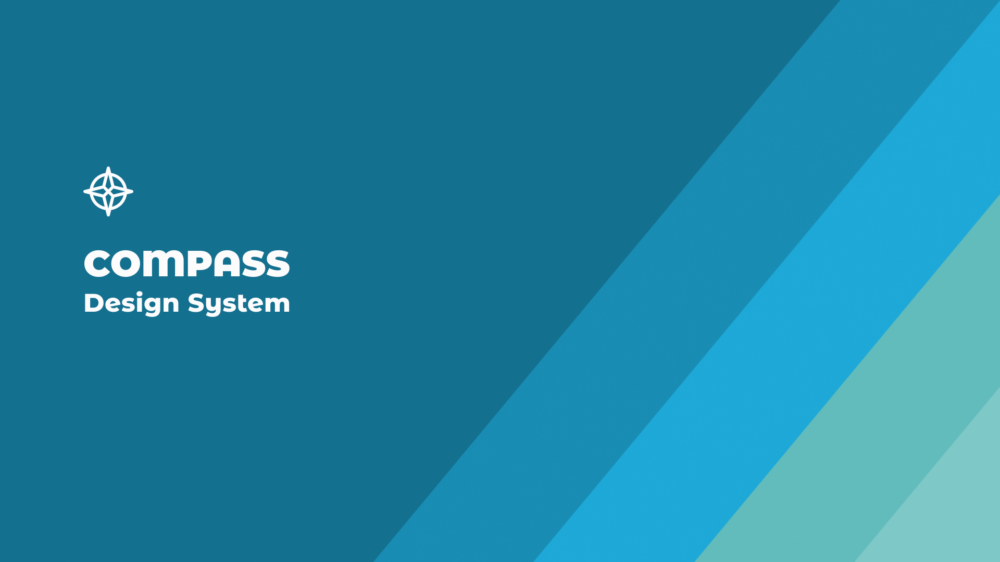

# Compass Design System

This design system was created for a learning management system (LMS) and includes two color themes,
each with light and dark modes. Any and all parts of this design system can be changed or expanded,
or used as provided here.

---


## Creation

This app was created using the following commands. (Run from the `compass-design-system` directory.)

```
npm create vite@latest .

npm install --save-dev sass
npm install @phosphor-icons/react react-router-dom
```


## Development

To start development and/or run this app locally, use the following commmands. (Run from the
`compass-design-system` directory.)

```
npm install
npm start
```

The local app will run on port 2509. This port can be changed in `package.json`.


## Design

https://www.figma.com/design/Yxnpa2GlBJdskRWt9ymziZ/Compass-Design-System
