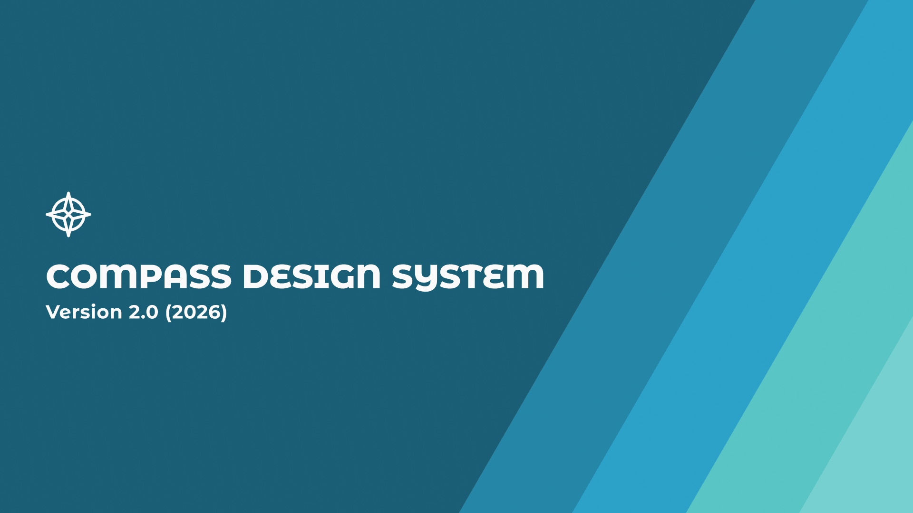

# Compass Design System

This design system was created for a learning management system (LMS). It includes two colour themes,
each with light and dark modes. Any and all parts of this design system can be changed or expanded,
or used as provided here.

---


## Creation

This app was created using the following commands. (Run from the `compass-design-system` directory.)

```
npm create vite@latest .
npm install @phosphor-icons/react react-router-dom
```


## Development

To start development and/or run this app locally, use the following commmands. (Run from the
`compass-design-system` directory.)

```
npm install
npm start
```

The local app will run on port 25121. This port can be changed in `package.json`.


## Design

https://www.figma.com/design/xZrAdG2DbluIZ1u5UhtsBB/Compass-Design-System-2.0-2026


## File Structure

```
lib/ - design system components & styles
  └ components
  └ styles
src/ - design system website
  └ components
  └ pages
```

### Additional updates

1. Add/update `tsconfig.app` with:

```
  "compilerOptions": {
    ...
    "paths": {
      "@lib/*": ["./lib/*"],
      "@src/*": ["./src/*"]
    },
    ...
  },
  "include": ["src", "lib"]
```

2. Add to `vite.config.ts`:

```
export default defineConfig({
  plugins: [react()],
  resolve: {
    alias: {
      '@lib': fileURLToPath(new URL('./lib', import.meta.url)),
      '@src': fileURLToPath(new URL('./src', import.meta.url)),
    },
  },
})
```

---


## Themes

Compass ships with two colour themes — **Tourmaline** (default) and **Amethyst** — each available in a
light and a dark mode. Both axes are controlled by attributes on the `<html>` element:

| Attribute    | Values                     | Default                                   |
| ------------ | -------------------------- | ----------------------------------------- |
| `data-theme` | `tourmaline` \| `amethyst` | `tourmaline`                              |
| `data-mode`  | `light` \| `dark`          | follows the OS (`prefers-color-scheme`)   |

Mode is resolved entirely in CSS with `color-scheme` and `light-dark()`, so the default tracks the
operating system with no flash and no JavaScript on load. Setting `data-mode` overrides the OS
preference at runtime.

### Switching at runtime

Two components (exported from `@lib/components`, and used in the `ScreenHeader`) drive the attributes:

- `<ThemeSelect />` — switches `data-theme`
- `<ThemeModeToggle />` — switches `data-mode`

Selections are **not persisted**: a full page reload returns to Tourmaline + the OS mode. Because the
attributes live on `<html>`, a choice does carry across in-app (client-side) navigation.

### Using theme tokens

Build components against the semantic tokens in `lib/styles/base/colors.css` rather than the raw
palette, so they respond to theme and mode automatically:

- Backgrounds — `--color-background-neutral-light` / `-default` / `-dark`
- Foregrounds — `--color-foreground-strong` / `-default` / `-subtle` (plus `-contrast-*`)
- Accents — `--color-primary`, `--color-secondary`
- Border — `--color-border-neutral`

```css
.my-component {
  background: var(--color-background-neutral-light);
  border: 1px solid var(--color-border-neutral);
  color: var(--color-foreground-strong);
}
```

Each colour also exposes a `-10` (lightest) → `-160` (darkest) scale, e.g. `--color-tourmaline-50`. The
status palettes — `garnet` (danger), `emerald` (success) and `tanzanite` (info) — follow the same
scale.
